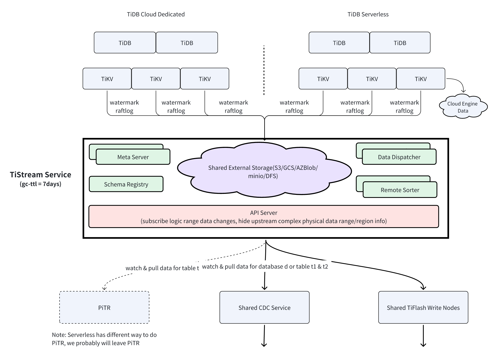

# TiStream

A cloud-native data change stream service for TiDB Cloud. See [design](./docs/design/20240220-tistream.md) for more details.

## Code Structure

- docs/design: feature or architecture design docs.
- pkg/codec: encoding and decoding of different type of data files
- pkg/dispatcher: remote data dispatcher workers, dispatch upstream changes to corresponding sorters.
- pkg/remotesorter: remote sorter workers, organize upstream data changes in commit-ts order and flush them as incremental data change files.
- pkg/schemaregistry: upstream clusters/tenants' table schema registry, contains all upstream table schema history for last n days where n is configurable.
- pkg/metaserver: meta server is responsible for cluster health monitoring, tasks persistent, workload balancing, etc.
- pkg/apiserver: providing api for downstream system to query and subscribe database or table's data changes stream.
- pkg: and other reusable modules.
- cmd: target binary files.
- proto: protobuf definition files