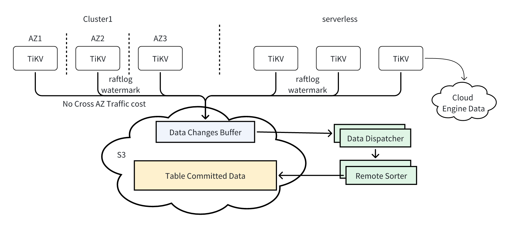

# Background
There are a lot of issues with current CDC, PiTR and TiFlash. Some of them block cloud native architecture evolution, some of them are architecture defects that are hard to optimize, some of them are duplicate works that are hard to maintain, etc.


- Complex Network Setup:  The diagram above shows the connections between TiKV nodes and CDC nodes, between TiKV nodes and TiFlash nodes. You can find that there are connnections between each TiKV and CDC/Tiflash pair, it means the network between TiKV and CDC as well as TiFlash should be connected.
- Share CDC Cluster for multiple upstream TiDB clusters/tenants is hard, because each upstream TiDB clustser may deployed in different VPC (like TiDB Cloud Dedicated Tier), this make sharing CDC clusters for these TiDB upstream Clusters is hard which is a blocker for pay-as-you-go CDC service(PM's pay-as-you-go planing).
- Maintenance burden of TiKVProxy: TiKVProxy is a component embeded in TiFlash, essentially it is a forked TiKV with some modification to adjust TiFlash, its responsibility is participate in the raft process as the Learner Role. TiKVProxy pretends itself as TiKV replica and receives raftlog from TiKV cluster. Everytime TiKV has modifications, bug fixes, and architecture changes, TiKVProxy need to followup or cherry-pick and upgrade. There were a few bugs and oncalls due to the inconsistency between TiKV and TiKVProxy.
- Duplicated works between CDC, TiFlash and PiTR: CDC team and TiFlash team handle the duplicated schema registry logic as well as data ranges (regions) split/merge events separately in both repo.
- Duplicated codes in TiKV for CDC and PiTR: CDC and PiTR are two different components built upon TiKV's raftlog stream. CDC observes raftlog stream for table's row ranges (withour indices range) and tidb meta ranges (DDL) because the downstream just care about the row changes and schema changes. As a contrast, PiTR observes raftlog stream for the whole range of a table (with indices) because PiTR's goal is to restore table/database to a new TiDB cluster by applying these raftlogs. (TiDB serverless cloud storage engine uses totally another way to do PiTR, we can leave the dedicated PiTR issue?)
- Coupled TiKV and TiFlash: From the above diagram we can see TiFlash is highly coupled with TiKV, all TiFlash's data must have 3 copys in TiKV, this highly coupled relationship make TiFlash only is row store's accelerating index, hard to expand TiFlash to more data analytical scenarios on the cloud. Besides this, TiFlash, highly coupled with TiKV's physical data ranges(region) and schema, is hard to do some optimization like partition, make TiFlash lose competetiveness in terms of performance.
- Authentication and Authorization: anyone who knows the IP address of TiKV can pull data out from TiKV nodes. Adding extra authentication for the TiKV layer is not a good idea since the TiDB layer already has an RBAC system.
- Inefficient Incremental Scan for CDC: When there are data range leaders changes or changefeed pauses and restart, CDC will request incremental scans for these data ranges or specific databases or tables. Incremental scans are not efficient (scan RocksDB ranges, use SST's user defined property max-ts to skip some SST files, it is highly dependent on what the internal LSM tree structure looks like for these regions) and might eat a lot of TiKV's resources, which cause large replication lag as well as has an impact on online service for upstream TiDB clusters. We have encountered this type of issue many times in many customer production clusters. This is an architectural defect that can't be addressed by the current CDC.
- GC-TTL may cause TiDB MVCC performance issue: when a changfeed (replication) is paused by intension or failed need manual operations, the GC of upstream TiDB will be blocked as long as GC-TTL whose default value is 24h. There are 2 drawbacks: 1) 24h might not be enough to let the user handle the failure and restart the changefeed (replication) from last checkpoint, user can enlarge the default gc-ttl value, but this will make 2 worse; 2) upstream TiDB's GC blocked might has a performance regression and space amplification.
Support Serverless and Dedicated Tier with the same CDC architecture is hard.

# Goals
- Use TiStream Service to simplify the network dependency between TiKV & CDC
- Downstream CDC has no impact on upstream TiDB's performance, at most 5% impact in worst case.
- SLA: upstream TiDB clusters can keep 99.99% availability. The TiStream Service has 99.95% availability.
- 5s p99 CDC replication lag
- Support pay-as-you-go CDC service on Cloud for Dedicated Tier
- Security: CMEK
- 80% lower cost compare to vanilla dedicated CDC
- Reduce redundant works between PiTR, CDC and TiFlash, reduce TiKVProxy maintenance cost.
- read data from TiFlash has 5s level data freshness.

# Design

## TiStream Service: Shared External Storage to Store Incremental Changs


The basic idea of TiStream Service is to provide a unified data change center, it receives, sorts, stores and caches upstream TiDB clusters' data changes and watermark information. All components depends on raftlog can build upon this unified Data Change Stream Service. 
We choose shared external storage like s3 to store incremental data change files instead of streaming queues like Kafka, because of unlimited storage capacity and simple API of shared external storage.
The unlimited storage capacity gives the TiStream Service a capability that retains as much as data change files. So it is easy to tune how many days data changes we want to retain, without concern about its scalability. The upstream write data changes to TiStream Service in the format of batch files, which is efficient for external storage.
The simple API of cloud external storage makes the system very easy to maintain in the future.

## TiStream Push Endpoint

The TiStream Service doesn't need to know where these upstream TiDB clusters are. It provides a public endpoint (Object storage endpoint), and these upstream TiDB clusters can push their data changes and watermarks to this endpoint periodically and asynchronously. In this way, there is no cross AZ traffic cost, even TiKV nodes are deployed in different AZs. Each cluster/tenant will push its data changes and watermarks to its own data_change_buffer/cluster-id folder. There will be an asynchronous notification to TiStream's meta server tell TiStream which upstream cluster/tenant has new data change files. So the dispatcher components 
Under the cluster's folder, each TiKV node has a corresponding sub-folder. Each TiKV node pushes its data changes as well as watermarks in the form of batch files. Each TiKV node will batch all its leader data ranges and their corresponding watermarks into a file, and flush the file to the data changes buffer in configured frequency like per second. In this batch way, to reduce the total cost of object storage requests. For example, we have 100 TiKV nodes, each node flushes their batch file per second. 3600(s) * 24(h) * 30(d) * 100(nodes) * 0.005 /1000 (price of S3 requests) = $12.96 per month for the PUT requests part which is very cheap for such large cluster.

### Folder Structrue

The data_change_buffer is kind of like CDC and TiFlash's uncommitted buffer which cache received uncommitted data. Each tenant(in serverless case) or cluster(in dedicated case) has a dedicated folder to store its incremental data changes. We choose tenant level folder is because of the CMEK consideration in the multi-tenancy architecture, different tenant may use different encryption key to encrypt data files. Because Object Storage like S3 has performance quota for a specified prefix, so we should ref to https://docs.aws.amazon.com/AmazonS3/latest/userguide/using-prefixes.html to design a good prefix structure of storage.
```
|
|____data_change_buffer/cluster-{1}/Tenant-{1}
|  |____schema_snap
|  |____store-{1}
|  |  |____file-{ts}
|  |  |____file-{ts}
|  |____store-{2}
|  |  |____file-{ts}
|  |  |____file-{ts}
|  |____store-{3}
|     |____file-{ts}
|____data_change_buffer/cluster-{2}/Tenant-{1}
|  |____store-{id1}
|  |____store-{id2}
|  |____store-{id3}
```

### Schema Snapshot

If a tenant or cluster is registered for the first time in the TiStream, upstream tenant or cluster should push its schema snapshot to the TiStream service. Because upcoming data changes and schema changes in raftlog are incremental data, doesn't contain the whole picture schema of this tenant or cluster. This initial schema snapshot and upcoming schema changes in the raftlog togather construct the schema information of this tenant or cluster, so the downstream system like CDC can decode the content with correct schema.
After the TiStream service constructs and persists the schema information for registered tenants or clusters, it is safe to remove the schema snapshot in the above folder.

## Data Dispatcher



Remote data dispatchers read and dispatch incremental raftlog and watermarks from store data change buffer, the sorters sort committed data in commit-ts order and then write them to table committed data folder after the sorters received corresponding water-mark information of this table or range.
Each dispatcher can handle multiple upstream TiKV nodes' data changes, but one TiKV node's data changes must be handled by one dispacher exclusively at any time. Each sorter can handle multiple logical continuous data ranges, but each logical continous data range just can be handled by one sorter. If there is a large table, the large table can be handled by multiple sorters, but each data range only can be handled by one sorter.


The dispathers can reclaim files in the store data change buffer if they can confirm all messages sent to target sorters have persisted (achieved by prewrite buffer and sorter buffer's periodically snapshot).
The bottleneck of Data Dispatcher should be the network bandwidth of the node because there are few computation works. For example, a data dispatcher on aws 4xlarge ec2 instance with 625MB/s network bandwidth, theoretically can dispatch 2.15TB incremental data per hour, 51.5TB per day.

## Remote Sorter

Each logical continuous data range is handled by one specified sorter, following diagram shows sorter A handles range[a, g) and sorter B handles range [g, z). The sorter will organize the data changes for this range, in the order of commit-ts. And then flush them as committed data files.


###  Watermark Map

Each sorter internally constructs a B+Tree map to manage range slices watermark for each continuous range. When there is a hole for the continuous range in terms of watermark, it means there must be some data is not ready in this range. The minimal watermark (120 in above diagram) of this range can be the watermark of this range, the sorter buffer can use it to flush all data before it.

```
type Range struct {
    start []byte // start of this range
    end []byte // end of this range
}

type RangeWaterMark struct {
    subRange Range
    RangeId uint64
    RangeVer uint64

    latestWatermark uint64
}

type RangeWatermarkMap struct {
    range Range
    lastFlushed uint64
    m *btree.BTreeG[RangeWaterMark]
}

func (m *RangeWatermarkMap) Watermark() uint64 {
    // If there is a hole in this continuous range, then return 0.
    // Else return the minimal watermark of this range.
}

func (m *RangeWatermarkMap) Update(w *RangeWaterMark) {
    // If range not in the map, insert.
    // If range split/merge, use the watermark of latest RangeVer to update corresponding range.
}
```

### PreWrite Buffer

Prewrite buffer is place that hold uncommitted data, it likes vanilla CDC's Matcher. Basically, it holds all prewrite requests, a prewrite key can be moved to the sorter buffer after it received its corresponding commit message. If the commit messages arrive before prewrite request, this would happen if there are leader transfer or range split happens. Prewrite buffer will hold these commit messages, and then wait for their prewrite requests.
The content of prewrite buffer and sorter buffer will be periodically persisted to external storage, so: 1) the Dispatchers can remove files from store data change buffer; 2) after the sorter restart or crash, the job of this range can recover to the checkpoint, this is important when we schedule ranges between different sorters.
```
type prewriteKey struct {
    key []byte
    startTs uint64
}

tyep commitMsg struct {
    key []byte
    startTs uint64
    commitTs uint64
    Op Operation // Commmit or Rollback
}

type PrewriteBuffer struct {
    range Range

    // prewrite-key -> content
    unmatchedPrewrite map[prewriteKey]*row

    // commit message arrives before prewrite, this can happen when range split or leader transfer
    unmatchedCommit map[prewriteKey]*commitMsg
}

func (b *PrewriteBuffer) saveToStorage() {
    // Persistent the content of buffer, so:
    // 1) the Dispather can remove files from store data change buffer;
    // 2) after the Sorter restart or crash, can recover from checkpoint.
    // 
    // Todo: need to do some optimizations (like incremental save) for large transactions to reduce write amplification.
}
```

### Sorter Buffer

The SorterBuffer hold committed data, when the
``` 
type SorterBuffer struct {
    range Range
    engine SortEngine // PebbleDB or other sort engine   
}

// Add committed data to the sorter buffer.
func (b *SorterBuffer) Add(commitTs uint64, key []byte, content []byte)

// Flush data between lowWatermark and highWatermark to external storage.
func (b *SorterBuffer) flushTo(lowWatermark, highWatermark uint64, s3Path string)

// Clean data between lowWatermark and highWatermark.
func (b *SorterBuffer) cleanData(lowWatermark, highWatermark uint64)

// Persist all the content to external storage.
func (b *SorterBuffer) saveToStorage()
```

### Data Range Split

There are a lot of data range split and merge events in upstream TiKV clusters. Vanilla CDC needs to rescan the data ranges after data ranges split or merge. Rescaning is the root cause of large unstable replication lag and its impact on the upstream can't be ignored. TiFlash also needs to handle these complicated data range split and merge events.
In the new architecture, each TiKV store's raftlogs and watermarks will be handled by one dispatcher. For example, there is a range[a, c) belonging to table t. Before this range splits, all its raftlogs and watermarks will be routed to sorter A through dispatcher A. After split, the new range's leader may be in another TiKV node, and its raftlogs and watermarks will also be route to sorter A, but through dispatcher b. 
The dispatcher don't need to handle complicate split/merge logic, it just route the raftlogs and watermarks by its logical range. The sorters will handle these raftlogs' content and watermarks and sort them by commit-ts. BTW, each watermark contains which data range it belongs to and what is the data range's version, so the sorter can advance watermarks for tables correctly.


If the new split range's leader is in the same node as the old range's leader, there is no out of order issue for the range [a, c), all changes will be route to sorter in raftlog's order. If the new split range's leader is in another node as the old range's leader, there is a case that dispatcher B in the above diagram is faster than dispatcher A, which means the new splitted range[b, c) raft logs may arrive earlier than the old range [a, c)'s raft logs from sorter A's perspective. Let's go deep into this split case:
Sorter A received the new range 3 leader's raftlog [b, c) log-idx 1~5 and watermark 105 first, and then received the old leader [a, c) 's log-idx 1~11 and watermark 100, received [a, b) log-idx 12~14 and watermark 110 last. We can apply these changes out of order in the prewrite buffer even they change the same key, because each operation contains a timestamp, etheir start ts or commit ts. For example there are some prewrite and commit for the key b, before split and after split. As we have described, range 3's logs come first, the prewrite buffer would receive range 3 log-idx 1 range 3 log-idx 2 range 3 log-idx 2 and then receive range 2 log-idx 1, their operations list here:
range 2 log-idx 1: key = b, value = xxxxxx, start-ts = 90, op = prewrite // arrive sorter A at last
range 3 log-idx 1: key = b, commit-ts = 100, op = commit
range 3 log-idx 2: key = b, value = zzzzzz, start-ts = 101, op = prewrite
range 3 log-idx 3: key = b, commit-ts = 105, op = commit
The Prewrite Buffer can move key = b, value = zzzzzz, commit-ts = 105 to the Sorter Buffer, but needs to cache range 3 log-idx 1 util receive range 2 log-idx 1 which is its corresponding prewrite and then can move key = b, value = xxxxxx, commit-ts = 100 to the Sorter Buffer. After receiving the range [b, c) watermark 105 and range[a, b) watermark 110, the above changes can be flushed as file. From this case, we can see that even if we apply the change in the prewrite buffer out of order, the time stamp and watermark mechanism can guarantee the committed data is flushed in order.


### Data Range Merge


When data merge, there is a case that the new leader's log(range2 in above diagram) arrives earlier than old merged leader's log (range3).

## Schema Registry

When a new TiDB Cluster starts to push data changes to the TiStream service, it will dump its schema snapshot to TiStream service first, and then push data changes for the "meta data" range which contains all schema changes. All dispatchers will send TiDB's meta changes to the schema registry, and the schema registry constructs schema history for the last n days. SchemaStorage is like vanilla CDC's SchemaStorage, which is a mvcc schema registry.

```
type SchemaStorage interface {
    GetSnapshot(clsuterId, TenantId, Timestamp) SchemaSnapshot // Get all schema for a tanent
    GetTables(clusterId, TenantId, DB, Timestamp) SchemaSet // Get all tables for a db
    
    SaveTo(S3Path) // Save schemas to external storage
}
```

## API Server

After the sorter sort and flush the data changes, data is organized by logical range (table) and ordered by committed timestamp. The API server provides API for downstream components to fetch these data changes for specified range.

```
// Subscribe data changes and schema changes for a specified table.
PullTable(cluster-id, tenant-id, database, table-name, start-ts)

// Subscribe data changes and schema changes for a specified database.
PullDB(cluster-id, tenant-id, database, start-ts)

// Subscribe data changes and schema changes for a specifed tenant.
PullTenant(cluster-id, tenant-id, start-ts)

ListDBs(cluster-id, tenant-id, start-ts)

ListTables(cluster-id, tenant-id, db, start-ts)
```

API server highly depends on internal schema registry, all above APIs need to query schema information from the 

## Meta Server

Dispathers and Sorters are workers, there must be a meta server to:
1) assign tasks to dispathers and sorters when the system started;
2) balance the workload between dispatchers and sorters to keep workload evenly distributed;
3) tasks re-assignment during scale-in/out dispatchers and sorters;
4) healthy detection and high availability.

### Meta Management
First responsibility of meta server is meta management, there are two kinds of meta data, tenant 
We choose RDS to store TiStream service's meta data in each region.

```
CREATE DATABASE tistream;

CREATE TABLE tistream.tenants {
    id int(10) primary key,
    cluster_id int(10), // Belongs to which cluster
    data_change_buffer_addr varchar(255),
    kms varchar(255),
    range_start varchar(255),
    range_end varchar(255),
}

CREATE TABLE tistream.tasks {
    id int(10) primary key, // Task id
    tenant_id int(10), // Task belongs to which tenant. Typically there is just one task for each tenant, there might be multiple tasks if the tenant is large.
    range_start varchar(255), // Start key of this continuous range
    range_end varchar(255),
    dispatcher int(10), // Which dispatcher is responsible for this task
    sorter int(10), Which sorter is responsible for this task
    snapshot_addr varchar(255), // Where to store the task snapshot 
}

CREATE TABLE tistream.owner {
    id int(10) primary key, // There is only one row in this table, its id is 1. If there are multiple TiStream clusters in one region, then there should be multiple rows.
    owner int(10), // Who is the owner 
    last_heart_beat timestamp, // If the owner doesn't update heart beat for 10s, other nodes reenable can be the owner
}
```

### Task Assignment & Balancing

### Healthy Detection

#### Node Failure
Seems all things are going well, but what if one dispatcher or sorter crashed? If one dispatcher failed temporarily or permanently, corresponding TiKV nodes' data change buffer will not be consumed which will make the watermark of some tables not advance.
There must be a task scheduler cluster as the meta center of dispachers and soters


### Network Partition

## Scalability
### Scale-in/out Dispatchers
### Scale-in/out Sorters
### 100K Tables Scenario

## Resilience
### Scale-in and Scale-out of Upstream TiKV Clusters

## Multi-Tenant
### Metering
### Security: CMEK